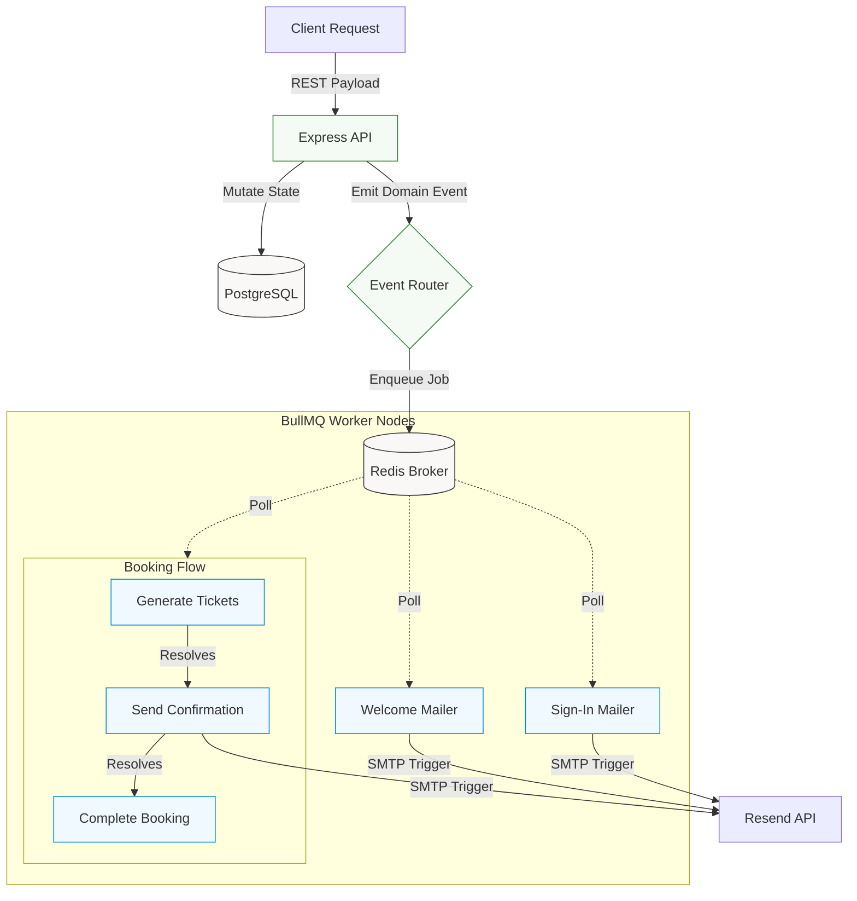

# Notifly

Event-driven backend service for authentication, booking management, and asynchronous email notifications.

## Architecture



## Tech Stack
- **API Runtime:** Node.js, TypeScript, Express.js
- **Persistence:** PostgreSQL, Prisma ORM
- **Message Broker:** Redis
- **Queue Engine:** BullMQ (Job Queues & Flow Producers)
- **Email Gateway:** Resend
- **Auth Layer:** bcrypt, express-jwt, jose

## Key Features
- Stateless authentication leveraging JWT validation middleware.
- Extensively typed booking management module.
- Event-driven architecture mapped via explicit domain routers.
- Hierarchical processing via BullMQ FlowProducers (e.g., ticket generation gates confirmation emails).
- Highly decoupled queue structure horizontally scalable across Redis nodes.

## Run Locally
```bash
npm install
npm run dev      # Spin up API server
npm run worker   # Boot isolated workers
```

## Project Structure
```text
src/
├── api/        # REST routes & stateless controllers
├── eventRoute/ # Domain-specific event routing mapping
├── events/     # Typed application event schemas
├── infra/      # Redis cluster & Prisma pool initialization 
├── queues/     # BullMQ standard production queues
├── services/   # Isolated core logic implementations
└── workers/    # BullMQ consumers & FlowProducers
```
