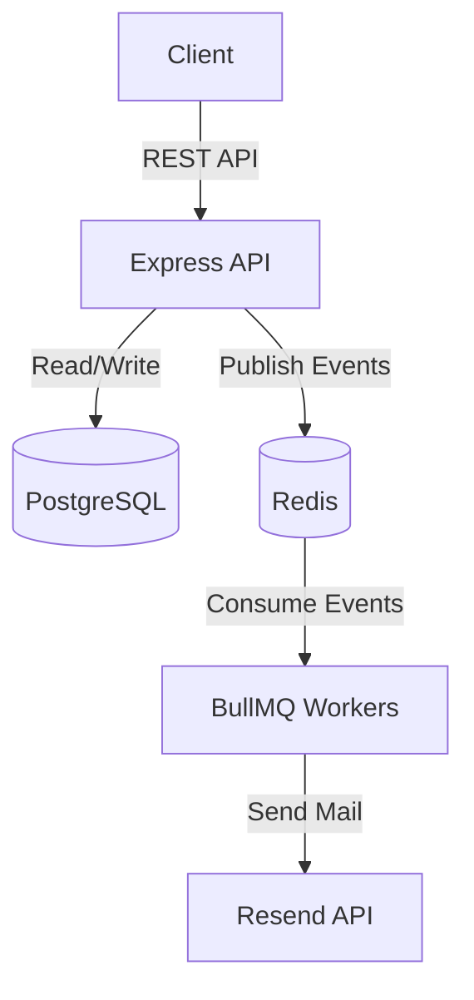

# Notifly

Event-driven backend service for authentication, booking management, and asynchronous email notifications.

## Architecture



## Tech Stack
- **Runtime:** Node.js, TypeScript
- **Framework:** Express.js
- **Database:** PostgreSQL, Prisma ORM
- **Queues/Caching:** Redis, BullMQ
- **Email:** Resend
- **Security:** bcrypt, express-jwt, jose

## Key Features
- Secure user authentication and JWT validation.
- Booking management module with payload validation.
- Asynchronous event-driven architecture.
- Background job processing for email notifications (welcome, sign-in, booking).
- Scalable queue management using Redis and BullMQ.

## Run Locally
```bash
npm install
npm run dev      # Start API server
npm run worker   # Start background workers
```

## Project Structure
```text
src/
├── api/        # REST routes & controllers
├── events/     # Event definitions & schemas
├── infra/      # Redis & Prisma setup
├── queues/     # BullMQ producers
├── services/   # Business logic (e.g., mailer)
└── workers/    # BullMQ consumers
```
